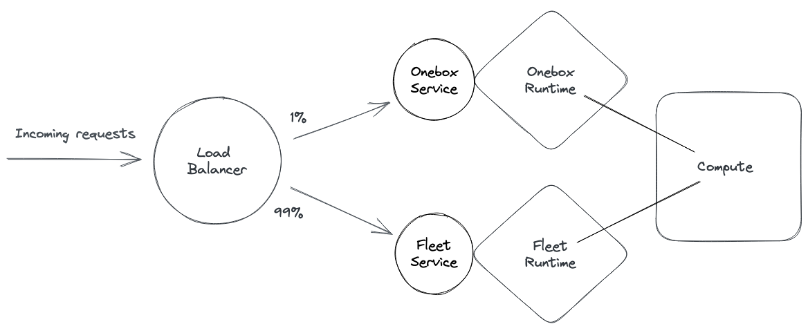
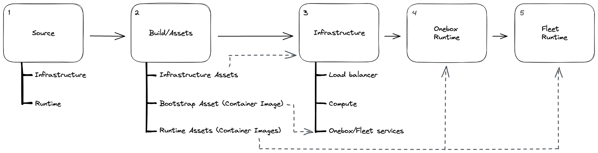
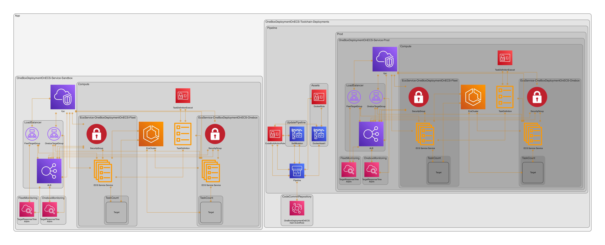

# Intro
This repository is an example of a backend service deployed to Amazon ECS using the [Onebox/Fleet deployment strategy](https://aws.amazon.com/builders-library/automating-safe-hands-off-deployments/).

# Overview
## Backend Service Architecture

### Components
1. Backend service runtime is deployed twice onto a compute layer
   1. The first deployment is called "Onebox", which gets a small percentage of the compute resources
   2. The second deployment is called "Fleet", which gets the rest of cumpute resources
2. Each of the deployments has a service listening for incoming requests
3. A load balancer acts as a reverse-proxy for both services

### Requests flow 
1. Incoming requests go through a load balancer
2. The load balancer splits the incoming requests between the Onebox and Fleet services with the weights:
   1. 1% of requests go to the Onebox service
   2. 99% of requests go to the Fleet service
3. The backend service Onebox and Fleet runtimes handle the incoming requests and return responses

## Deployment Pipeline


In this example project we use AWS CodePipeline and Amazon Elastic Container Service (Amazon ECS) to implement the Onebox/Fleet deployment strategy, the deployment process has the following steps: 
1. A push to the source code repository triggers the deployment pipeline
2. The pipeline runs a build and generates the infrastructure and runtime assets:
   1. Infrastructure assets
   2. A bootstrap container image asset that is only used the initial deployment
   3. Runtime container image assets that represent the latest versions of the runtime code
3. The pipeline deploys the infrastructure
4. The pipeline updates the Onebox deployment with the latest code
5. The pipeline updates the Fleet deployment with the latest code

Some notes on the process:
- The source repository stores both infrastructure and runtime code
- Both Onebox and Fleet Amazon ECS services use the [rolling update (ECS) deployment type](https://docs.aws.amazon.com/AmazonECS/latest/developerguide/deployment-type-ecs.html) (stages 4 and 5 in the diagram)
- Both Onebox and Fleet Amazon ECS services use the [Amazon CloudWatch alarms integration](https://docs.aws.amazon.com/AmazonECS/latest/developerguide/deployment-alarm-failure.html) to monitor for deployment failure
- When an Amazon CloudWatch alarm indicate a deployment failure, Amazon ECS initiates a rollback to the previous version

## AWS CDK Application

This AWS CDK application uses the same account to mimic three environments:
- Sandbox environment
  - Deploy the backend service to the sandbox environment
- Deployments environment
  - Create an AWS CodeCommit repository in the deployments environment
  - Deploy the toolchain to the deployments environment
    - The toolchain includes an AWS CodePipeline pipeline used to deploy to production
- Production environment
  - Deploy the backend service to the production environment


# Usage
## Prerequisites
### Clone This Repository
```
git clone git@github.com:aws-samples/onebox-deployment-on-amazon-ecs.git
cd onebox-deployment-on-ecs
```


### Install Dependencies
Install the CDK toolkit, CDK construct-library and other dependencies.
```
python3 -m venv .venv
source .venv/bin/activate

./scripts/install-deps.sh
```
### Install Docker
This AWS CDK application uses [Docker](https://www.docker.com/) to build container images. Make sure you have Docker [installed](https://docs.docker.com/engine/install/) and running on your machine.

## Deploy Backend Service To Sandbox
#### Deploy The BackendSandbox Stack
```
npx cdk deploy OneBoxDeploymentOnECS-Service-Sandbox
```
Once the deployment finishes, store the Application Load Balancer (ALB) URL in an environment variable:
```
export SANDBOX_ALB=$(aws cloudformation describe-stacks \
  --stack-name OneBoxDeploymentOnECS-Service-Sandbox \
  --query 'Stacks[0].Outputs[?OutputKey==`WebAPIEndpoint`].OutputValue' \
  --output text)

echo SANDBOX_ALB=$SANDBOX_ALB
```

#### Verify That The Backend Service Works
```
curl $SANDBOX_ALB
```
You should get `{"status": "OK"}`

## Deploy Toolchain
#### Create A New AWS CodeCommit Repository
To make it easier following the example, the next steps create an AWS CodeCommit repository and use it as source. In this example, I'm authenticating into AWS CodeCommit using [git-remote-codecommit](https://docs.aws.amazon.com/codecommit/latest/userguide/setting-up-git-remote-codecommit.html). Once you have `git-remote-codecommit` configured you can copy and paste the following commands:

```
REPO_NAME=$(aws codecommit create-repository \
    --repository-name oneboxdeploymentonecs \
    --output text \
    --query repositoryMetadata.repositoryName)
git remote set-url --push origin codecommit://${REPO_NAME}
```
#### Push Project Code 
```
git push 
```

#### Deploy The Toolchain Stack
```
npx cdk deploy OneBoxDeploymentOnECS-Toolchain-Deployments
```
Deploying the Toolchain stack automatically triggers the AWS CodePipeline pipeline. The pipeline deploys the backend service to production


Wait until the pipeline successfully finishes executing, then store the production ALB URL into an environment variable:
```
export PROD_ALB=$(aws cloudformation describe-stacks \
  --stack-name OneBoxDeploymentOnECS-Service-Prod \
  --query 'Stacks[0].Outputs[?OutputKey==`WebAPIEndpoint`].OutputValue' \
  --output text)

echo PROD_ALB=$PROD_ALB
```

#### Verify That The Backend Service Works
```
curl $PROD_ALB
```
You should get `{"status": "OK"}`


## Demonstrating The Onebox/Fleet Deployment Strategy
We want to showcase how Onebox stage catches a bug in the runtime code. We will show that the Amazon CloudWatch alarm triggers and causes Amazon ECS to roll back the deployment.

We are going to simulate a bug that causes the service to delay responses by inserting a `sleep` before responding to requests. **We expect the pipeline deployment to fail in the Onebox deployment pipeline stage**.

The Amazon ECS service deployments we created are using [Amazon CloudWatch alarms integration](https://docs.aws.amazon.com/AmazonECS/latest/developerguide/deployment-alarm-failure.html) to determine whether the new version of the backendservice works as planned. In this case, we tirgger an alarm when the ALB's `TargetResponseTime` metric value is higher than 3 seconds, for 3 consecutive minutes (configured in [constants.py](constants.py)).

For simulating user traffic we will use [siege](https://github.com/JoeDog/siege). Siege is an open source regression test and benchmark utility. To install, follow the instructions [here](https://github.com/JoeDog/siege/blob/master/INSTALL). Complete documentation for siege can be found at [www.joedog.org](https://www.joedog.org/).

1. Go to the backend service runtime code [app.py](service/web_api/app.py)
2. In `get_health()`, uncomment the `import time` and `time.sleep(6)` lines

       def get_health() -> str:
           import time
           time.sleep(6)
           return json.dumps({"status": HEALTH_OK})

3. Trigger a pipeline by pushing the "bugged" code into the AWS CodeCommit repository:
       
       git add .
       git commit -m "inject response delay to app"
       git push

4. Simulate traffic to the production environment:    
       
       siege --time=1H --concurrent=100 --benchmark $PROD_ALB
          
We expect the deployment to fail at the onebox pipeline stage and a rollback to take place.


## Cleanup

Delete the AWS CodeCommit repository
```
aws codecommit delete-repository --repository-name ${REPO_NAME}
```

Clean up all the resources created by AWS CDK
```
npx cdk destroy "**" -f
```

## Security

See [CONTRIBUTING](CONTRIBUTING.md#security-issue-notifications) for more information.

## License

This library is licensed under the MIT-0 License. See the LICENSE file.
